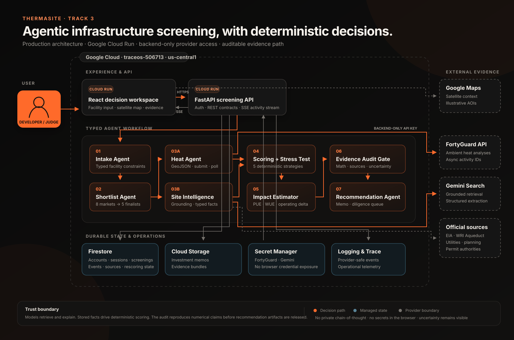

# ThermaSite

**Size the facility. Find the five places built for it.**

### [Try ThermaSite live →](https://thermaguard-1060372410958.us-central1.run.app)

**Judge access:** choose **Enter judge demo** for immediate access to the persistent demonstration workspace. No password or provider key is exposed.

- **Primary track:** Track 3 — Industrial & Enterprise
- **Demo guide:** [2:20 continuous demo script](docs/thermaguard-demo-script.md) — the narrated video is submitted with the entry and intentionally excluded from Git because it is a generated media artifact.

ThermaSite is an agentic facility-siting estimator built for **FortyGuard Hackathon '26, Track 3 — Industrial & Enterprise**. A developer enters the planned campus acreage, IT design density, utilization, and cooling architecture. ThermaSite turns that into a planning load, pre-screens a versioned catalog of eight U.S. data-center markets, sends the five strongest candidates to FortyGuard with identical dates and same-scale AOIs, and returns an auditable ranked shortlist.

Each finalist appears on the map with a generated footprint matching the requested acreage, its FortyGuard heat layer, and heat-adjusted power and direct-water estimates. Judges can enter a shared persistent demo workspace with one click.

## Hackathon build provenance

This repository was initialized on August 29, 2026, during the August 18–30 hackathon build window. ThermaSite's data-center product, FortyGuard integration, facility-first shortlist workflow, deterministic scoring and resource models, evidence audit, decision stress test, interface, documentation, and demo were built during the event.

The project reused a pre-existing generic FastAPI/React application shell and internal `terraforge` package name for orchestration, persistence, artifacts, event streaming, and Google Cloud deployment. The earlier habitat-oriented product logic and media features are not part of the submitted ThermaSite experience.

AI tooling is disclosed transparently: Google Gemini 2.5 Flash and Google ADK support the in-product research agents, OpenAI Codex assisted the solo entrant with implementation and testing, and ElevenLabs generated the demo narration. AI models do not set ThermaSite's numerical scores, resource projections, or investment-impact calculations.

## Why it matters

Early data-center site selection is fragmented across temperature data, utility economics, water constraints, zoning, fiber, logistics, and local permitting. ThermaSite turns that research into one decision workflow:

1. The **Intake Agent** converts facility size and priorities into typed requirements and normalized weights.
2. The **Shortlist Agent** pre-screens eight cited U.S. markets and selects five for equal-footing analysis.
3. The **Heat Agent** submits a facility-sized GeoJSON AOI for each finalist to FortyGuard and polls the asynchronous status API.
4. The **Site Intelligence Agent** assembles sourced permitting, power, water, and infrastructure evidence.
5. The deterministic **Scoring Engine** ranks the five markets. Models cannot alter numerical scores.
6. The **Resource Estimator** combines FortyGuard heat metrics with explicit PUE and WUE assumptions to project facility power and selected-window water ranges.
7. The deterministic **Decision Stress Test** replays stored facts through five buyer strategies and quantifies selected-window energy, water, and electricity-spend advantages.
8. The **Evidence Audit Gate** reproduces source coverage, rankings, resource calculations, investment-impact claims, and uncertain statements.
9. The **Recommendation Agent** produces a decision summary, diligence queue, investment memo, and evidence bundle.

The UI exposes plans, tool calls, provider statuses, citations, and validation outcomes—not private model reasoning.

## Architecture



ThermaSite separates probabilistic research from deterministic decisions. Cloud Run serves the React workspace and FastAPI screening API. The coordinator runs typed agent stages, calls FortyGuard and grounded research providers through backend-only connectors, then hands stored facts to deterministic scoring, resource estimation, and an independent audit gate. Firestore preserves accounts and screening state; Cloud Storage holds downloadable evidence; Secret Manager injects provider credentials at runtime.

The editable source for the diagram is available in [Mermaid format](docs/architecture/thermasite-architecture.mmd).

## Tech stack

| Layer | Technology |
| --- | --- |
| Web | React 19, TypeScript, Vite, TanStack Query, Leaflet, Recharts, Inter Variable |
| API | Python 3.11+, FastAPI, Pydantic, HTTPX |
| AI workflow | Google Gemini, Google Search grounding, Google ADK, typed two-stage fact extraction |
| Heat intelligence | FortyGuard Temperature API: asynchronous heatmap submission and status polling |
| Decision system | Deterministic Python scoring, resource estimation, robustness testing, and evidence audit |
| Persistence | Local filesystem in development; Firestore and Cloud Storage in production |
| Infrastructure | Docker Compose, Google Cloud Run, Secret Manager, Terraform |
| Quality | Pytest, Ruff, Vitest, ESLint, Playwright |

## Facility-first input

The launch screen asks only for the information a developer already has:

- Campus footprint in acres
- IT design density in MW per acre
- Cooling architecture
- Expected utilization
- Optional investment priorities

Planned IT capacity is calculated as `acres × design density`. The default 40-acre, 1.25 MW/acre profile therefore represents 50 MW of planned IT capacity. This is a screening assumption, not a utility-capacity commitment or a parcel design.

## Decision and resource model

Default ranking weights are thermal/cooling 40%, power 25%, water 15%, permitting 10%, and logistics/infrastructure 10%. User values are normalized to 100%.

- Thermal suitability combines FortyGuard mean temperature, maximum temperature, and the 35°C exceedance ratio.
- Power uses a pinned, attributed EIA industrial-price snapshot plus sourced utility context.
- Water uses a clearly labeled WRI Aqueduct screening proxy plus local-provider diligence notes.
- Permitting follows a readiness rubric and never represents a permit guarantee.
- Infrastructure covers transport, fiber ecosystem, workforce, and documented industrial readiness.
- Missing FortyGuard evidence leaves a site visible but unranked.
- Missing secondary evidence receives a neutral score of 50 with zero confidence, lowering decision readiness.
- Hard-constraint failures stay visible but cannot become the recommended site.

Facility power uses a heat-adjusted PUE scenario. Direct water is shown as a cooling-system WUE range, never a single guaranteed value. Estimates cover the selected July window; annual extrapolation is disabled by default and does not affect ranking. FortyGuard supplies the ambient-heat evidence—the deterministic estimator translates that evidence into planning scenarios.

The investment case compares the recommended site with the hottest and highest-cost finalists using the same facility profile. It reports selected-window energy and direct-water differences, plus an electricity-spend scenario based on attributed EIA state industrial averages. A five-strategy robustness test—current lens, thermal resilience, power economics, water constraint, and delivery speed—shows whether the recommendation survives a different investment mandate. These calculations use stored evidence only and are independently reproduced by the audit gate.

Each generated footprint is centered on an edge-of-market industrial search zone rather than a municipal centroid and matches the requested acreage. The close view uses keyless USGS aerial context so reviewers can see the surrounding land pattern. Aerial appearance does not establish vacancy or availability: the AOI is still an illustrative comparison, not a selected parcel, entitlement finding, utility-service boundary, or engineering layout.

## Run from scratch

The shortest reproducible path is Docker Compose. A native Python/Node path is also provided below.

### 1. Prerequisites

- Git
- Docker Desktop with Docker Compose, **or** Python 3.11+ and Node.js 22+
- A FortyGuard API key for new heatmap runs
- A Google Gemini API key only if you want live grounded research for custom, non-catalog sites

### 2. Clone and configure

```bash
git clone https://github.com/foundator779/ThermaSite.git
cd ThermaSite
cp .env.example .env
```

On Windows PowerShell, replace the last command with:

```powershell
Copy-Item .env.example .env
```

Edit the root `.env`. These are the only provider variables needed for the submitted workflow:

```dotenv
# Required to launch a new temperature screening; backend only
FORTYGUARD_API_KEY=replace_with_your_fortyguard_key
FORTYGUARD_BASE_URL=https://api.fortyguard.com

# Optional for live research on custom non-catalog candidates
GOOGLE_API_KEY=replace_with_your_gemini_key

# Local browser-to-API connection; this is not a secret
VITE_API_BASE_URL=http://localhost:8000
TERRAFORGE_API_ORIGINS=http://localhost:5173,http://127.0.0.1:5173
```

Never prefix the FortyGuard key with `VITE_`. ThermaSite reads it only in FastAPI and sends it to FortyGuard through the backend-only `api-key` header. `.env` is git-ignored.

### 3A. Run with Docker Compose

```bash
docker compose up --build
```

Wait until the API and web services are healthy, then open:

- App: `http://localhost:5173`
- API documentation: `http://localhost:8000/docs`
- Readiness check: `http://localhost:8000/api/v1/readyz`

Choose **Register** to create a persistent local account, or **Enter judge demo** for the shared demo workspace. Local users, sessions, and screenings are saved in the `terraforge-data` Docker volume.

### 3B. Run natively instead

From the repository root:

```bash
python -m venv .venv
source .venv/bin/activate
python -m pip install --upgrade pip
python -m pip install -e "backend[dev]"
cd frontend
npm ci
cd ..
```

Windows PowerShell activation is:

```powershell
.\.venv\Scripts\Activate.ps1
```

Start the API in terminal 1:

```bash
python -m uvicorn terraforge.main:app --app-dir backend/src --reload --port 8000
```

Start the web app in terminal 2:

```bash
cd frontend
npm run dev
```

Open `http://localhost:5173`. Native local state is saved under `.terraforge-data`, so refreshing the browser or restarting the API does not erase accounts or screenings.

### 4. First-run check

1. Open the app and register, sign in, or enter the judge demo.
2. Keep the default 40-acre, 1.25 MW/acre hybrid-cooled facility.
3. Select **Find my top five locations**.
4. Watch the trace reach `COMPLETED`, then verify five ranked candidates, map footprints, thermal layers, resource estimates, citations, and two downloadable artifacts.
5. Change a factor weight, apply the rescore, refresh the page, and confirm the saved result remains.

FortyGuard analysis is asynchronous and can take several minutes. The UI keeps the activity trace visible and reports authentication, plan, rate-limit, validation, provider-failure, and bounded-timeout states.

## Accounts and persistence

- Registration stores an scrypt password hash—never the plaintext password.
- Revocable 30-day sessions survive browser refreshes and backend restarts.
- Local development persists users, sessions, and screenings under `.terraforge-data`.
- Production persists account and screening records in Firestore.
- Every screening, event stream, rescore operation, and artifact download is owner-scoped.
- **Enter judge demo** opens the shared `judge@thermasite.demo` workspace without exposing a password.
- The browser remembers the last active screening for each account; starting a new screen does not delete earlier decisions.

## Demo journey

1. Enter a 40-acre campus, 1.25 MW/acre design density, hybrid cooling, and 85% utilization.
2. Launch **Find my top five locations**.
3. Watch the trace show catalog pre-screening, five matched FortyGuard AOIs, cited research, scoring, resource estimation, and audit.
4. Select rank cards to move the map between five generated facility footprints and compare heat-adjusted power and water projections.
5. Review the leading candidate, factor scores, confidence, hard constraints, and next diligence actions.
6. Inspect the selected-window operating advantage and five-strategy recommendation stress test.
7. Change power or water weight and apply an immediate persisted rescore without repeating provider calls.
8. Refresh to confirm the decision, impact case, and facility estimates remain saved.
9. Open **Evidence & memo** to inspect citations and download the investment memo/evidence bundle.

## API

- `POST /api/v1/screenings` — create and queue a facility-first screening
- `GET /api/v1/screenings` — list prior screenings
- `GET /api/v1/screenings/{id}` — retrieve complete state and results
- `GET /api/v1/screenings/{id}/events` — stream agent/tool activity over SSE
- `POST /api/v1/screenings/{id}/rescore` — rescore stored facts without paid research
- `GET /api/v1/site-catalog` — retrieve the versioned eight-market catalog and source metadata
- `POST /api/v1/screenings/{id}/estimate` — optional compatibility endpoint for a custom follow-up AOI
- `POST /api/v1/auth/register` — create an account and session
- `POST /api/v1/auth/login` — authenticate an existing account
- `POST /api/v1/auth/demo` — enter the shared judge demo
- `GET /api/v1/auth/me` — restore the active account after refresh
- `POST /api/v1/auth/logout` — revoke the active session
- `GET /api/v1/readyz` — report provider, persistence, and artifact readiness without credentials

Legacy `/api/v1/runs` contracts remain as compatibility routes during the hackathon conversion, but the ThermaSite frontend does not call them.

## Real FortyGuard API request and response

This is production evidence, not a mock. On **August 29, 2026 at 11:24 UTC**, screening `3a4c5d16-3b80-40d0-98ab-17341c8225d8` sent the following 40-acre New Albany, Ohio AOI to `POST /v1/heatmap`. The key is represented by an environment variable; it was never present in browser code or Git.

```bash
curl --request POST 'https://api.fortyguard.com/v1/heatmap' \
  --header "api-key: ${FORTYGUARD_API_KEY}" \
  --header 'Content-Type: application/json' \
  --data-raw '{
    "polygon_aoi": {
      "type": "FeatureCollection",
      "features": [{
        "type": "Feature",
        "properties": {"site_id": "columbus-oh"},
        "geometry": {
          "type": "Polygon",
          "coordinates": [[
            [-82.75136286809841, 40.1101884057971],
            [-82.74663713190158, 40.1101884057971],
            [-82.74663713190158, 40.1138115942029],
            [-82.75136286809841, 40.1138115942029],
            [-82.75136286809841, 40.1101884057971]
          ]]
        }
      }]
    },
    "date_time": {
      "start_date": "2026-07-01",
      "end_date": "2026-07-31",
      "filter_type": 4
    },
    "granularity": 100,
    "analytic_type": "tcm"
  }'
```

FortyGuard returned activity ID `51f1e68f-9636-4988-8447-58a96598a962`. ThermaSite persisted that ID and polled the documented unified status endpoint. The request below was re-run against that real completed activity on August 29 to verify the proof included here:

```bash
curl --request GET \
  'https://api.fortyguard.com/v1/status/51f1e68f-9636-4988-8447-58a96598a962' \
  --header "api-key: ${FORTYGUARD_API_KEY}" \
  --header 'Content-Type: application/json'
```

Genuine response excerpt:

```json
{
  "error": false,
  "status_code": 200,
  "message": "Completed",
  "data": {
    "activity_id": "51f1e68f-9636-4988-8447-58a96598a962",
    "status": "Completed",
    "result": {
      "map_data": {
        "type": "FeatureCollection",
        "features": [
          {
            "id": "0",
            "type": "Feature",
            "properties": {
              "tile_id": 0,
              "average_temperature": 24.2367,
              "min_temperature": 11.6767,
              "max_temperature": 35.3024
            },
            "geometry": {
              "type": "Polygon",
              "coordinates": [[
                [-82.7516372472826, 40.11022652293091],
                [-82.75046653780272, 40.11024422741162],
                [-82.75048885322963, 40.1111144434992],
                [-82.75165957761544, 40.11109673847631],
                [-82.7516372472826, 40.11022652293091]
              ]]
            }
          }
        ]
      },
      "stats_data": {
        "temperature_stats": {
          "minimum": 24.2046,
          "maximum": 24.2372,
          "mean": 24.22075,
          "standard_deviation": 0.012369101287751838
        }
      }
    }
  }
}
```

The excerpt preserves the provider's field names and values while omitting 15 additional GeoJSON features and the long distribution arrays for readability. The completed production record contains both the TCM activity above and exceedance activity `bd7e0d47-1d45-4813-b6b7-f3670bfc1c19`.

## Verification

```bash
ruff check backend analysis_runtime
$env:PYTHONPATH='backend/src;.'; pytest -q backend/tests analysis_runtime/tests
cd frontend
npm run lint
npm test -- --run
npm run build
npm run test:e2e
npm run demo:verify
```

`demo:verify` checks the deployed judge login, persisted screening, keyless runtime configuration, USGS aerial tile load, and absence of a Google Maps browser script. Paid-provider smoke tests remain opt-in because they consume provider calls.

## Deployment

The production web and API services run on Google Cloud Run in project `traceos-506713`. Firestore stores users and screenings, Cloud Storage stores artifacts, and Google Secret Manager injects FortyGuard and Gemini credentials into backend services only. The browser receives no provider API keys; USGS aerial tiles require no credential. Credentials are never returned in readiness output or activity logs.

## Sources and attribution

- Event requirements and API workflow: [FortyGuard Hackathon '26 Participant Handbook](https://drive.google.com/file/d/1GPAke_0Nez8vaRFs_gqzUsZmQoptsjL3/view)
- Temperature analytics: [FortyGuard Temperature API](https://docs-api.fortyguard.com/)
- Industrial electricity snapshots: [U.S. Energy Information Administration](https://www.eia.gov/electricity/annual/table.php?t=epa_02_10.html)
- Water-risk framework: [WRI Aqueduct](https://www.wri.org/aqueduct), used under CC BY 4.0 with local verification required
- Permit and development evidence: official municipal planning/development sources listed per candidate
- Aerial basemap: [USGS The National Map](https://www.usgs.gov/programs/national-geospatial-program/national-map), USGS Imagery Topo service

## Known limitations — what does not work yet

- **No parcel discovery or land-availability proof.** Footprints are facility-sized AOIs centered on industrial-edge search zones. USGS aerial imagery provides context but does not prove vacancy, ownership, zoning, environmental clearance, or suitability.
- **No permit or utility transaction workflow.** ThermaSite does not file permits, reserve grid capacity, secure interconnection, obtain water rights, negotiate tariffs, or claim that a project is by-right.
- **Catalog evidence is a screening snapshot.** Preset markets use versioned EIA, WRI Aqueduct, municipal, utility, and infrastructure sources. Facts can become stale and must be revalidated during diligence. Custom sites remain provisional if live grounded research fails.
- **Resource estimates are scenarios, not designs.** PUE/WUE, power, water, cooling-cost, and investment-impact outputs depend on editable assumptions and cover the selected window. Annual extrapolation is off by default. No cooling-system engineering or full financial underwriting is performed.
- **U.S.-only and bounded in scope.** New FortyGuard requests accept U.S. coordinates, dates from `2021-01-01`, windows of at most 31 days, and AOIs no larger than 10 square miles. The submitted UI demonstrates a July 2026 comparison rather than continuous portfolio monitoring.
- **External providers can block a fresh run.** A missing/invalid key, exhausted plan, rate limit, provider outage, or polling timeout prevents new thermal analysis. Saved completed screenings remain viewable; the app does not fabricate substitute temperatures.
- **Account recovery is not implemented.** Registration, scrypt password hashing, login, logout, revocable sessions, owner scoping, and persistent storage are real. Email verification, password reset, MFA, organization administration, and social login are outside this hackathon build.
- **Not a professional opinion.** ThermaSite prioritizes due diligence; it does not replace legal, environmental, engineering, permitting, water-rights, utility-capacity, or investment review.
